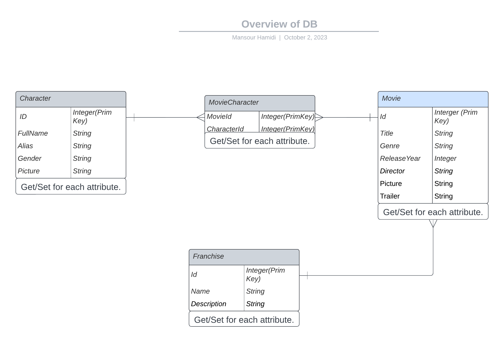

# 06_assignment

## Team mates
- [Frederik Strøm Friborg](https://github.com/Freddo2300)
- [Mansour Hamidi](https://github.com/MansourHamidi94)
- [Marc Pedersen](https://github.com/BareMarcP)
## Getting started
To get started with this repository, clone it like so:
```term
git clone https://github.com/Freddo2300/06_assignment.git
```
### Installing and running docker image
Because that none of the group members have Microsoft machines, we resolve this by using docker.

Assuming that you have the latest version of docker installed, install the latest MSSQL image like so:
```term
sudo docker pull mcr.microsoft.com/mssql/server:2022-latest
```
Now, you can run docker compose to spin up a container for that image, like so:
```
docker-compose up -d
```
### Building the database
To build the database, there is already a Migrations folder containing entity framework-generated files for generating the database. To apply the migrations files and build the database, run the following:
```term
dotnet ef database update
```
### Running the project
Assuming that all the aforementioned steps have been completed, proceed by running:
```
dotnet run
```